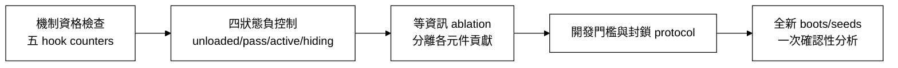

# KICBA 外部審查意見再評估與修正決議

日期：2026-09-21  
審查對象：`KICBA_TWO_TRACK_REVIEW_20260921.zip` 之外部 AI 分析  
文件性質：對審查意見的獨立複核；不是新實驗結果

> **後續狀態註記：**本文是當時審查回應。同日稍後先完成 D7 單開機
> active-logic、composition 與 nesting pilots，再依事前鎖定 protocol 完成 D7-r1
> 八開機正式確認。Nesting invariant 在 384 batches 上為 100% hiding recall、
> 三種 control 0% FPR，13 條方法功效規則全部通過。這項新結果已納入最新兩份
> 論文與 `docs/DATASET_AND_EVIDENCE_MAP_zh-TW.md`；它以結構訊號取代 D6 timing
> 主線，不改寫 D6-r2 frozen 數字，也不使 D6 的 timing 因果解讀或方向 B 的安全
> 線上自適應主張事後成立。

## 1. 總體決議

外部分析的主要方法學批評成立。D6-r2 數字本身可重算且與正式報告一致，但現有因果解讀過強。當前證據可支持：

> 在單一 VM／kernel、CARAXES-like `filldir` 檔案隱藏與受控目錄／工作負載中，以 pass-through `filldir64` 負控制校正的 timing gate，於 D6-r2 觀察到 93.75% hiding recall、0% unloaded FPR 與 1% sham FPR。

現有證據不足以支持：

- 已分離出「惡意隱藏語義」而非額外 callback 計算成本；
- 已對一般合法 kernel hook、其他 Rootkit、其他 kernel／硬體維持低誤報；
- D6-r2 已通過整體預設功效規則；
- online adaptation 已安全且有效。

因此，方向 A 仍可作為畢業專題主線，但必須改為「受控 benchmark 中的低誤報初步證據」；方向 B 維持負面結果／後續研究定位。

## 2. 逐點複核

| 審查意見 | 獨立判定 | 證據或原因 | 本次處理 |
|---|---|---|---|
| D6-r2 主要數字沒有明顯算錯 | 接受 | `predictions.csv`、`overall_metrics.csv` 與 `report.json` 一致 | 保留數字，修改語義與邊界 |
| sham 只 hook `filldir64`，hiding 安裝 5 個 hooks | 接受 | `caraxes_sham.c` 僅一個 `HOOK_NOSYS`；`hooks.h` 有五個 | 不再稱「完整控制相同 hook 成本」 |
| 現有 audit 未證明其他四個 callbacks 未觸發 | 接受 | audit 檢查 `iterate_dir` 角色、輸出與 lost events，並未計數五個 callback | 列為必須補的 invocation-counter 機制實驗 |
| sham 沒有控制 `strstr` 與 branch 成本 | 接受 | hiding 每個 directory entry 執行名稱比對；sham 直接 pass through | 將特徵改稱 hiding-associated timing evidence；規劃 active-logic sham |
| security axis 無 attack-label leakage | 接受 | threshold 只用 clean+sham calibration，hiding test 未進入 fit | 保留，但不稱 malware-semantic axis |
| security axis 假設 benign complexity 不會超過 sham | 接受 | `max(clean+sham)+0.01` 只對已知負控制建立上界 | 明記 monotonicity／open-set benign limitation |
| comparator 資訊量不對等 | 接受 | proposed 有 per-boot clean+sham、context split 與新 feature；public-style comparator 僅 clean 且 threshold 來自 D5 | 不再將全部差異歸因於 factorization；要求 equal-information ablation |
| blind W50 不宜寫成直接打敗 Trace online method | 接受 | D6 是持續 deployment-style replay，上游線上評估對 transition/mixed window 另有處理 | 改稱「將 W50 update core 置於持續重播的 stress test」 |
| 1,800 batches 不是 1,800 個獨立重複 | 接受 | 最高層獨立單位是 5 boots | 不使用「統計顯著」；報 boot-paired CI 與 n=5 限制 |
| Latin square 已完全消除 order effect | 不成立 | 每個 sequence 只有一個 boot，boot 與 sequence 無法分離 | 改為「平衡 ordinal position，不能估計 sequence effect」 |
| 0% unloaded FPR 可外推到普遍正常系統 | 不成立 | 只涵蓋 900 個指定 VM／目錄／工作負載批次 | 全部加上受測範圍限定 |
| sham workload cells 不完整 | 接受 | test sham 僅 baseline 與 CPU，無 memory／mixed | 列為下一輪必補 cells |
| `max+0.01` 對極端值與 boot 敏感 | 接受 | 最差 boot 的 high-context threshold 偏高並對應 CPU／mixed 漏報 | 規劃 quantile／conformal calibration，不回頭重調 D6 |
| Track A 是 D6 失敗後重新聚焦 | 部分接受 | D6 整體 9/15 PASS；但 FPR、sham FPR、F1 原本已預設，非全新事後 endpoint | 明寫「整體 FAIL，低誤報子集呈正向證據」，且兩條 FPR superiority 規則仍 FAIL |
| review ZIP 可完整 raw→report 重現 | 不成立 | 舊包缺 extractor、context axis、collector dependencies 與 raw batches | 新建 R2 包，保留舊包作歷史記錄 |

## 3. 立即修正與不可用文字修正的部分

### 3.1 本次立即完成

1. 收窄 Track A 的摘要、貢獻、結果解讀與結論。
2. 將程式名稱 `security_gate` 的論文語義改為「negative-control-calibrated timing gate」；程式欄位不回溯改名，以保留 frozen analysis hash。
3. 明記 D6-r2 整體 preregistered FAIL，包含兩條 FPR superiority rule FAIL。
4. 加入 comparator information asymmetry、n=5、Latin-square 未重複、sham 缺 cell 等限制。
5. 修正 blind W50 為 deployment-style continuous replay 之壓力測試。
6. 當時建立包含 raw D6、必要依賴、測試與重現指令的 R2 歷史包；目前
   `KICBA_AI_REVIEW_CURRENT` 改採 metadata／reports／code 封裝，raw 由 canonical
   路徑另取，避免每次打包重複大型資料。

### 3.2 必須以新實驗回答，不可只改文字

1. 五個 callbacks 是否實際觸發：必須加 per-hook invocation counters。
2. hook framework、`strstr` 判斷與真正 suppression 的成本：必須建立 matched pass-through 與 active-logic sham。
3. factorization 是否獨立貢獻：必須做 equal-information ablation。
4. sham 在 memory／mixed 負載下的 FPR：必須補齊試驗格子。
5. order effect 與 boot effect：每種 sequence 必須有多個獨立 boots。
6. 外部效度：必須加入其他合法 hook／Rootkit、kernel 或硬體。

## 4. 下一階段的研究邏輯

下一階段不應立即開始另一次「相同 D6」，也不應用 D6 試到滿意門檻後把它當新確認結果。正確順序為：

四狀態因果控制應為：

| 狀態 | 安裝相同五 hooks | 執行相同名稱判斷 | 實際隱藏 |
|---|---:|---:|---:|
| Unloaded | 否 | 否 | 否 |
| Matched pass-through sham | 是 | 否 | 否 |
| Active-logic sham | 是 | 是 | 否 |
| Hiding | 是 | 是 | 是 |

若 active-logic sham 也大量觸發警報，正確結論將是「時序法偵測 callback computational behavior，無法單獨識別惡意隱藏語義」，而非繼續調門檻隱藏此結果。

## 5. 目前最誠實的論文狀態

- 方向 A：研究問題與數據現象成立；因果特異性尚未充分驗證。
- 方向 B：blind contamination 問題成立；安全自適應方法未成功。
- D6-r2：是有效的、已鎖定的五開機證據，但整體功效判定為 FAIL。
- 投稿準備：不應先追求更高 F1；應先完成 matched／active sham、equal-information ablation 與新資料驗證。
